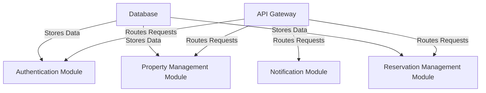
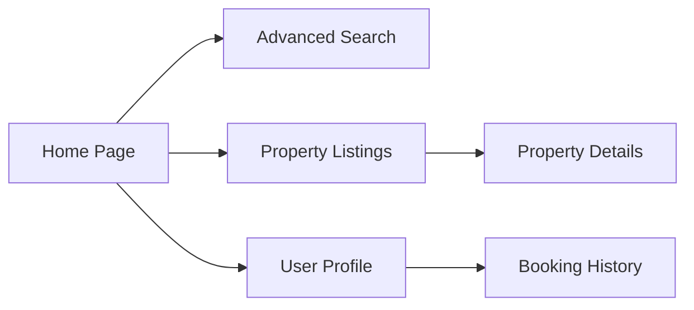
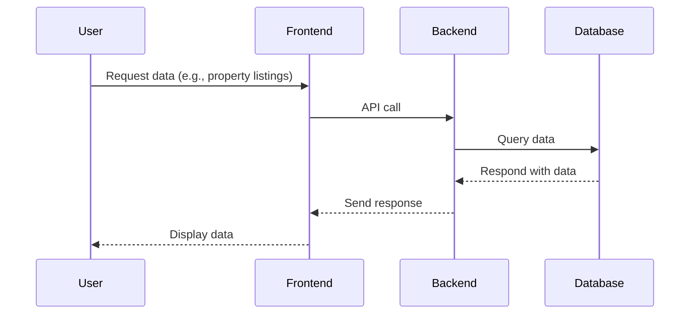

# Architecture Documentation

## Overview
The Dungeon Directory platform's architecture is designed to handle scalability, security, and user experience for its niche audience. The system integrates a modular backend, a dynamic frontend, and real-time communication features.

## Backend
The backend is built using **Node.js** and **Express.js**. Key responsibilities include:
- **Authentication**: User login, registration, and multi-factor authentication via Auth0.
- **Property and Booking Management**: CRUD operations for properties and reservations.
- **Messaging and Notifications**: Real-time communication using Socket.io.

### Backend Modules

	
##Frontend
The frontend uses React.js and Next.js for a responsive, modern user interface. It supports:

Advanced Search: Filters properties by location, amenities, and hourly/nightly rates.
Real-Time Notifications: Displays booking updates instantly.
Accessibility Features: Fully compliant with WCAG standards.

###Frontend Components

##Data Flow
The system employs a RESTful API for communication between the frontend and backend, with WebSocket connections for real-time updates.

##Database
The platform uses PostgreSQL, managed via Prisma ORM. Key models include:

User
Property
Reservation
Real-Time Communication
Real-time notifications and messaging are powered by Socket.io, ensuring instant updates for bookings and messages.

##Deployment
The platform is deployed on Azure with:

App Services: For hosting the backend and frontend.
PostgreSQL Database: Managed database for reliability and scalability.
Azure Storage: For storing media and static assets.
Security Measures
Authentication: Multi-factor authentication via Auth0.
Encryption: Data is encrypted both in transit and at rest using industry-standard protocols.